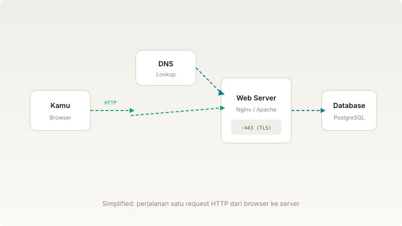
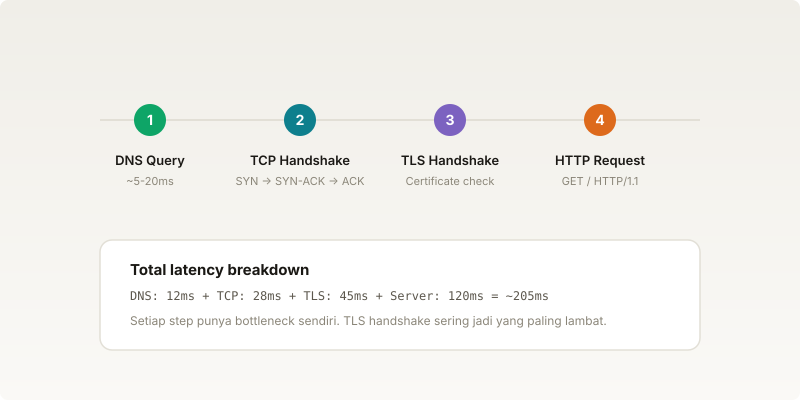

Halo! Kali ini kita bahas sesuatu yang kita pakai setiap hari tapi jarang dipikirin: **internet**.

Setiap kali kamu buka browser dan ketik URL, ada serangkaian proses yang terjadi di balik layar — dan semuanya terjadi dalam hitungan milidetik.

## Ilustrasi

Ini diagram sederhana yang nunjukin alurnya:

## Step by Step

Oke, mari kita bedah satu per satu.

### 1. DNS Query

Ketika kamu ketik `thestoriesrifki.com` di browser, komputer kamu nggak langsung tahu alamat IP-nya. Jadi dia tanya ke **DNS server**: "hei, `thestoriesrifki.com` itu IP-nya berapa?"

DNS server kemudian nyari di database-nya dan balikin jawaban: `185.199.108.153` (atau IP lainnya).

Proses ini biasanya cuma butuh **5-20 milidetik**.

### 2. TCP Handshake

Setelah punya IP, browser harus buat koneksi ke server. Caranya lewat **TCP three-way handshake**:

1. Client kirim **SYN** (sinyal: "aku mau mulai koneksi")
2. Server balas **SYN-ACK** ("oke, aku siap")
3. Client kirim **ACK** ("sip, mulai ya")

Baru setelah ini data bisa dikirim bolak-balik.

### 3. TLS Handshake

Kalau situsnya pakai HTTPS (yang sekarang hampir semua), ada satu step lagi sebelum data dikirim: **TLS handshake**. Ini proses di mana client dan server sepakat pakai encryption apa, dan server nunjukin sertifikat-nya biar client yakin ini beneran server yang dituju.

TLS handshake ini biasanya jadi **bottleneck paling lambat** — bisa makan 40-100ms tergantung jarak dan sertifikat.

### 4. HTTP Request

Baru deh, setelah koneksi terenkripsi jadi, browser kirim **HTTP request** — biasanya `GET / HTTP/1.1` untuk minta halaman utama.

Server terima request, proses (ambil dari database, render template, dll), dan kirim **HTTP response** berisi HTML, CSS, JavaScript, dan aset lainnya.

## Kenapa Ini Penting?

Memahami cara kerja internet bantu kamu:

- **Debug lebih cepat** — kalau loading lambat, kamu tahu mana yang mungkin jadi bottleneck
- **Bikin aplikasi lebih baik** — mengerti kenapa HTTP/2, CDN, dan caching itu penting
- **Interview lebih pede** — pertanyaan "jelaskan apa yang terjadi setelah kamu ketik URL" itu pertanyaan klasik

## Kesimpulan

Internet itu kompleks, tapi proses dasarnya bisa dipahami langkah demi langkah. Yang paling penting untuk diingat:

1. **DNS** — translate nama ke IP
2. **TCP** — bikin koneksi yang reliable
3. **TLS** — bikin koneksi yang aman
4. **HTTP** — kirim dan terima data

Kalau ada pertanyaan, langsung aja tanya di kolom komentar!
